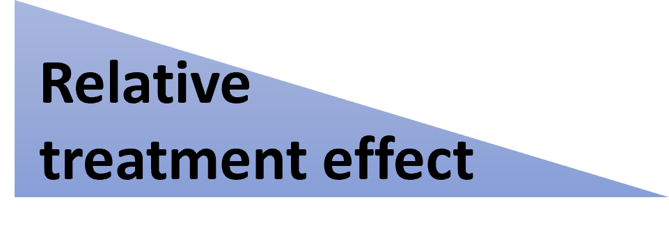
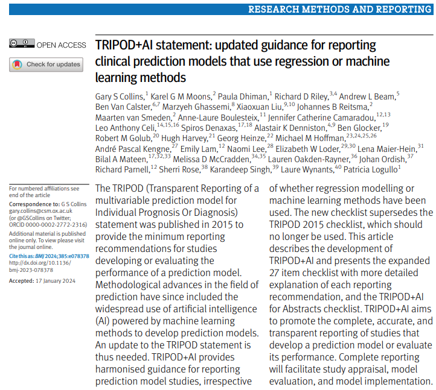
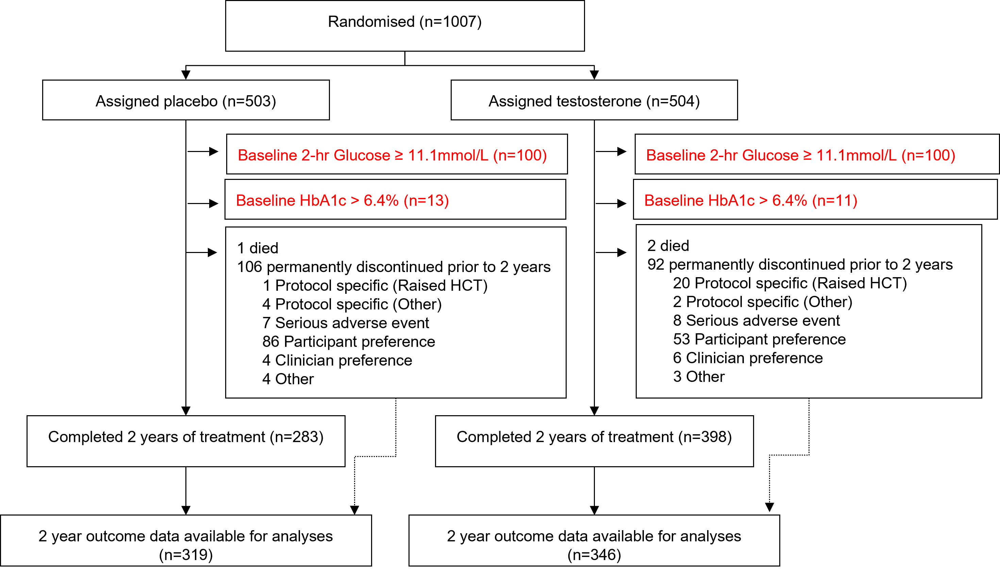
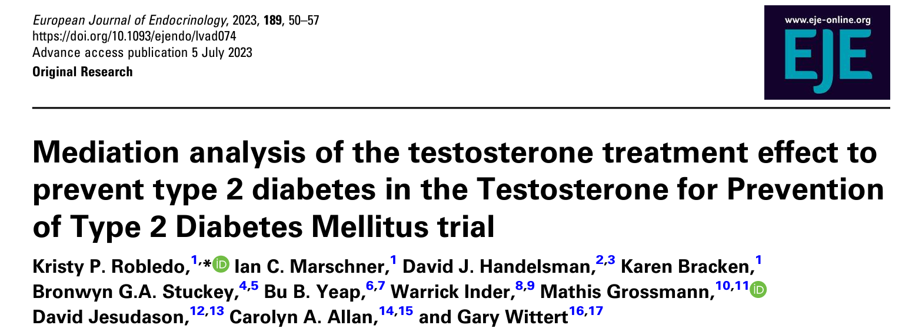
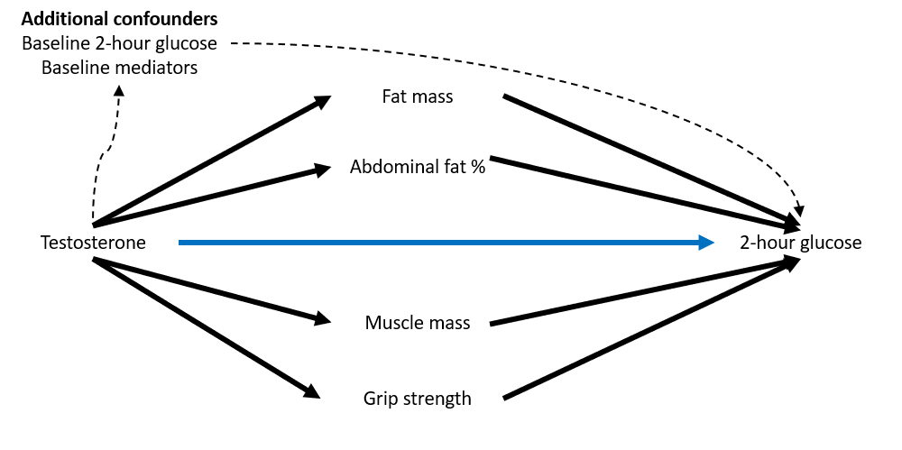

```{r, echo = FALSE}
library(tidyverse)
library(plotly)
library(naniar)
library(gtsummary)
library(gt)
library(patchwork)
library(haven)
library(janitor)
library(labelled)
```

# Overview of today's talk

-   Prediction versus inference
-   What is prediction modelling?
-   Prediction example: Risk score model
-   Inference example: Mediation analysis
-   The future...

## [**Inference**]{style="color:red;"} (explaining) versus [**Prediction**]{style="color:blue;"} (future) {.center}

<br>

::::::: columns
::: {.column width="15%"}

:::

::: {.column width="35%"}
<center>

[**Explaining**]{style="color:red;"}

- collect data from given sample (e.g. clinical trial)
- apply models to test hypotheses (explain relationships)
- inference can be causal 

</center>
:::

::: {.column width="15%"}

:::

::: {.column width="35%"}
<center>

[**Prediction**]{style="color:blue;"}

-   apply a model to data
-   predicting new or future observations

</center>
:::
:::::::

::: fragment
<center>**Explanatory** 
**predictive**</center>
:::

::: footer
[Shmueli (2010) To Explain or to Predict? Statistical Science.
25(3):289-310. DOI:
10.1214/10-STS330](https://doi.org/10.1214/10-STS330)
:::

::: notes
regression models are a common example.

explanatory power of a model is not the same as the predictive power of
a model - and different methods may be appropriate for these two
different approaches
:::

# What is prediction modelling?

::: incremental

- prognostic modelling
- risk prediction modelling
- risk calculators

:::


## [Diagnostic]{style="color:red;"} vs [Prognostic]{style="color:blue;"} models {.center}

<br />

<br />

::::::::::: columns
::: {.column width="15%"}
 
:::

::::: {.column width="35%"}
<center>[**Diagnostic**]{style="color:red;"}</center>

::: fragment
-   Predicts the presence or absence of a disease or condition
:::

::: fragment
-   e.g. breast cancer detection
:::
:::::

::: {.column width="15%"}
 
:::

::::: {.column width="35%"}
<center>[**Prognostic**]{style="color:blue;"}</center>

::: fragment
-   Prediction of a disease course (including treatment)
:::

::: fragment
-   eg. probability of CVD events for a patient with diabetes
:::
:::::
:::::::::::

::: notes

:::

## Pipeline for translation of a clinical trial into practice

:::: fragment
::: {data-id="box1" style="width: 200px; height: 150px; border:5px solid green; margin: 10px; position: absolute; top: 300px; left: 0px"}
<center>**Individual** absolute risk (current treatment)</center>
:::
::::

:::: fragment
::: {data-id="box2" style="background: green; width: 200px; height: 150px; margin: 10px; border-radius: 50px; position: absolute; top: 100px; left: 0px"}
<center><br><span style="color:white;">**Risk prediction
model**<span></center>
:::
::::

:::: fragment
::: {data-id="box2" style="width: 200px; height: 50px; margin: 10px; position: absolute; top: 250px; left: 85px"}

:::
::::

:::: fragment
::: {data-id="box2" style="width: 50px; height: 150px; margin: 10px; position: absolute; top: 350px; left: 225px"}
<center>**x**</center>
:::
::::

:::: fragment
::: {data-id="box3" style="width: 200px; height: 150px; border:5px solid blue; margin: 10px; position: absolute; top: 300px; left: 300px"}
<center>Relative risk reduction (new treatment)</center>
:::
::::

::: fragment
{style="width: 300px; position: absolute; top: 150px; left: 300px"}
:::

:::: fragment
::: {data-id="box2" style="width: 200px; height: 50px; margin: 10px; position: absolute; top: 250px; left: 420px"}

:::
::::

:::: fragment
::: {data-id="box2" style="background: blue; width: 350px; height: 80px; margin: 10px; border-radius: 50px; position: absolute; top: 50px; left: 275px"}
<center><span style="color:white;">**Predictive Biomarker** (clinical
trial)<span></center>
:::
::::

:::: fragment
::: {data-id="box2" style="width: 50px; height: 150px; margin: 10px; position: absolute; top: 120px; left: 420px"}

:::
::::

:::: fragment
::: {data-id="box2" style="width: 50px; height: 150px; margin: 10px; position: absolute; top: 350px; left: 525px"}
<center>**=**</center>
:::
::::

:::: fragment
::: {data-id="box3" style="width: 200px; height: 150px; border:5px solid black; margin: 10px; position: absolute; top: 300px; left: 590px"}
<center>**Personalised** absolute risk reduction</center>
:::
::::

:::: fragment
::: {data-id="box2" style="width: 50px; height: 150px; margin: 10px; position: absolute; top: 350px; left: 810px"}

:::
::::

:::: fragment
::: {data-id="box3" style="background: orange; width: 100px; height: 100px;  margin: 10px; position: absolute; top: 325px; left: 850px"}
<center>size of benefit</center>
:::
::::

:::: fragment
::: {data-id="box2" style="width: 50px; height: 150px; margin: 10px; position: absolute; top: 350px; left: 960px"}

:::
::::

:::: fragment
::: {data-id="box1" style="background: #ee7600; width: 250px; height: 250px; border-radius: 60px; margin: 10px; position: absolute; top: 250px; left: 1000px"}
<center><br><br>Decision for practice/policy</center>
:::
::::

::: notes
also Resources/ Community values and Patient's preferences and utilities
information about harm from clinical trial

basically - baseline risk + clinical trial effect -\> personalised care
-\> policy

Doctors and other healthcare professionals use statements about prognosis to inform individuals and their families about likely future outcomes and help make decisions with individuals and their families about the best care and treatments to improve those outcomes.
:::

# Methods for developing predictive models

##  {background-image="wordcloud_pred.png" background-size="contain"}

## Current reporting guidelines

 

::: footer
<https://www.bmj.com/content/385/bmj-2023-078378>.

:::

# Prediction example: T4DM risk score model

##  {background-image="ejepub.PNG" background-size="contain"}

## Development cohort: T4DM trial

:::::: columns
::: {.column width="50%\""}
-   males aged 50 to 74 years,
-   waist circumference ≥95 cm,
-   impaired glucose tolerance or newly diagnosed type 2 diabetes,
-   fasting testosterone ≤14 nmol/L

<br>

[**Primary outcome:**]{.blue} Diabetes at two years, as measured by
2-hour glucose by OGTT $\ge$ 11.1mmol/L
:::

:::: {.column width="50%\""}
::: fragment
{style="width: 700px;height:600px; position: absolute; top: 50px; left: 550px"}
:::
::::
::::::

::: footer
Wittert G, Bracken K, Robledo KP, et al. Testosterone treatment to
prevent or revert type 2 diabetes in men enrolled in a lifestyle
programme (T4DM): A randomised, double-blind, placebo-controlled,
2-year, phase 3b trial. The Lancet Diabetes & Endocrinology
2021;9:32–45. <https://doi.org/10.1016/S2213-8587(20)30367-3>
:::

```{r, eval=FALSE,echo=FALSE}
##create wordcloud - this only needs to be run once to create the wordcloud

library(wordcloud2)
library(tidyverse)
library(webshot)
library(htmlwidgets)

df <-as_tibble(
  riskfactors<-c("risk factors", "age", "waist circumference", "weight", "marital status", "current smoker", "shift worker status", "SSRI use", "family history of diabetes", "skeletal muscle mass", "total fat mass", "abdominal fat %" , "total testosterone", "estradiol (E2)", "sex hormone-binding globulin (SHBG)", "2-hour glucose", "Fasting glucose", "glycated haemoglobin (HbA1c)", "insulin", "total cholesterol", "LDL-c", "HDL-c",  "triglycerides", "insulin resistance (HOMA-IR)", "steady state beta cell function (HOMA-B)" , 
               "Lower urinary tract symptoms (LUTS)", 
               "SF-12 physical" ,"SF-12 mental", "MAC-relative to yourself", "MAC- within society generally", "Sense of Coherence", "Pearlin’s Personal Mastery Scale", "CES-Depression Inventory",  "Sufficient exercise"), 
  
) %>%
  add_column(freq = c(2, rep(1,33)))


riskf<-wordcloud2(data=df, size=0.2, color='random-dark',shape = 'rectangle')
saveWidget(riskf, "tmp.html", selfcontained = F)
webshot("tmp.html", "wordcloud.png", delay = 10, vwidth=600, vheight = 400)

```

##  {background-image="wordcloud.png" background-size="contain"}

## Sample size assumptions


:::::: columns
::: {.column width="50%\""}
- 665 participants available for development model
- overall event rate of 10% at 2 years
- C-statistic of ~0.78 (based on AUSDIAB)
- Cox-Snell R-squared value of 0.2 (conservative anticipated model performance reflecting signal:noise, with low being more noise)
:::
::::::

:::fragment
***16 risk factors can be considered before overfitting becomes a concern***
:::

:::fragment
{style="width: 400px;height:400px; position: absolute; top: 50px; left: 550px"}
:::

:::footer
Riley RD et al. Calculating the sample size required for developing a clinical prediction model. BMJ 2020. <https://doi.org/10.1136/bmj.m441>.

Further guidance:
<https://www.prognosisresearch.com/guidance-prognostic-models>
:::

:::notes
 sample size should be at least large enough to minimise model overfitting and to target sufficiently precise model predictions
:::

## Preliminary step: Data completeness

```{r, fig.cap = "Intersection of missingness over risk factors in the 783 participants (all eligible cohort)"}
eligdf<-readRDS('eligibledf.RDS')
compdf<-readRDS('compdf.RDS')

eligdf %>% 
  select(-subjectkey,-glucose) %>%
  gg_miss_upset(nsets = 10) 
```

::: footer
naniar::gg\_\_miss_upset() function to plot the missingness using an
upset plot
:::

## Step one: Univariate analyses

```{r, tab.cap="Summary and univariate logistic regression models for the 35 risk factors"}
compdf %>% 
  select(-subjectkey, -ogtt_gt11,-glucose) %>%
  mutate(bmleanms=bmleanms/1000,
    bmfatms=bmfatms/1000) %>%
  tbl_summary(type = list(mac_1~ "continuous")) ->t1

compdf %>% 
  select(-subjectkey, -treat,-glucose) %>%
  mutate(bmleanms=bmleanms/1000,
    bmfatms=bmfatms/1000) %>%
  tbl_uvregression(method = glm, 
                   y=ogtt_gt11, 
                   method.args = list(family = binomial(link="logit")),
                   exponentiate = TRUE, 
                   hide_n =TRUE) %>%
  add_global_p() %>%
  sort_p() ->t2

tbl_merge(list(t1,t2), tab_spanner = c("Summary", "Univariate models")) %>%
  as_gt() |>
  tab_options(
    container.overflow.y=TRUE, 
    ihtml.active=TRUE,
    ihtml.use_sorting=FALSE,
    ihtml.use_search=TRUE,
    ihtml.use_highlight=TRUE,
    ihtml.use_compact_mode=TRUE,
    quarto.use_bootstrap=TRUE)
```

::: footer
gtsummary::tbl_summary() function to summarise the data, combined with
gtsummary::tbl_uvregression() to run univariate logistic regression
models, merged together using gtsummary::tbl_merge()
:::

## Step two: 33 to 16 risk factors

```{r, fig.cap = "Visualisation of coefficients from LASSO model, with all 33 risk factors included", fig.dim=c(6,6)}
glmnet.fit1<-readRDS("glmnet_fit1.rds")

plotmo::plot_glmnet(glmnet.fit1, label=16)
```

::: footer
plotmo::plot_glmnet() to plot a glmnet::glmnet() object
:::

## Step three: select from 16 risk factors + fit model

::::: columns
::: {.column width="50%\""}
-   LASSO penalisation[^1] using 469 with complete data
-   10 fold cross validation was used to maximise AUC
-   dotted line denotes max AUC, with two non-zero covariates selected
    in the model (HbA1c and 2-hour glucose)
-   refit without penalisation, with AUC **0.809** (n= 665 patients)
-   including T treatment[^2], AUC **0.816**.
:::

::: {.column width="50%\""}
```{r, fig.dim=c(3,4)}
load("lasso_cv.Rdata")
plotly::ggplotly(lasso.cv +
                   xlab("Log(lambda)") )
```
:::
:::::

[^1]: Zhao S, Daniela Witten, Ali Shojaie "In Defense of the
    Indefensible: A Very Naïve Approach to High-Dimensional Inference,"
    Statistical Science. 36(4), 562-577, (November 2021)
    <https://doi.org/10.1214/20-STS815>

[^2]: **T treatment was associated with 40% reduction in diabetes at two
    years**

::: footer
plotly::ggplotly() to interactively plot a ggplot object
:::

:::notes
Least absolute shrinkage and selection operator (LASSO) penalisation was performed to select risk factors, prevent over-fitting, and reduce the dimensions of the prediction model [12]. To determine the penalty factor (λ), tenfold cross validation was performed, to maximise the area under the curve (AUC).
:::
## Step four: exploration of interactions

```{r}
load("p1.Rdata")
load("m1_p1.Rdata")
load("m3_p1.Rdata")
load("m2_p1.Rdata")
load("distp.Rdata")

# p1+m1_p1+m3_p1+m2_p1+distp+distp +
#   plot_annotation(tag_levels = 'A')+
#   plot_layout(nrow = 3, 
#               heights = c(1,1,0.4), 
#               guides='collect') &
#   theme(legend.position='bottom')
```

::::::::: columns
::::: {.column width="50%\""}
::: fragment
```{r, fig.dim=c(3,3)}
(p1)
```
:::

::: fragment
```{r, fig.dim=c(3,3)}
(m1_p1+theme(legend.position = "none"))
```
:::
:::::

::::: {.column width="50%\""}
::: fragment
```{r,  fig.dim=c(3,3)}
(m3_p1+theme(legend.position = "none"))
```
:::

::: fragment
```{r,  fig.dim=c(3,3)}
(m2_p1)
```
:::
:::::
:::::::::

::: notes
Linear on the logit. 

There was no interaction between treatment and baseline glucose, or
treatment and age at baseline. Let us investigate the following four
models for the interaction between Hba1c and treatment. Note that the
median HbA1c level is 5.6%. (A) a typical linear interaction (B) a
piecewise linear regression approach (or ‘broken stick’) allowing
different intercepts for treatment, and different slopes for each
treatment before and after 5.6% (C) a reduced broken stick model, with
an intercept for treatment but a common slope before 5.6%, and different
slopes for each treatment before and after 5.6% (D) a further reduced
broken stick model, with a common intercept and slope before 5.6%, and
different slopes for each treatment before and after 5.6% From the
Figure below, there does not appear to be a difference between (C) and
(D), and on investigation of the model fit (Table S3), model (D) has the
lowest AIC, indicating best model fit, as well as a comparable
C-statistic to other models.
:::

## 3D plot


```{r}
load("baselinemodel_age.Rdata")

gridlines = 100

#prediction matrix
cxhba1c <- seq(min(4.1), max(6.4), length.out = gridlines)
cxglu2h <- seq(min(7.7), max(11), length.out = gridlines)

xy <- cbind(expand.grid( cxhba1c=cxhba1c, cxglu2h = cxglu2h))

tibble(xy, treat=0) |>
  mutate(
    age=59,
    t_x = case_when(treat==0 ~0,
                treat==1 & cxhba1c<5.6  ~0,
                treat==1 & cxhba1c>=5.6~ cxhba1c-5.6)) ->predmat_t0

tibble(xy, treat=1) |>
  mutate(
    age=59, 
    t_x = case_when(treat==0 ~0,
                    treat==1 & cxhba1c<5.6  ~0,
                    treat==1 & cxhba1c>=5.6~ cxhba1c-5.6)) ->predmat_t1

## calculate predictions
z.pred_t0 <- matrix(predict(baselinemodel_age,
                            type=c("response"),
                            newdata = predmat_t0)*100,
                 nrow = gridlines, ncol = gridlines)

z.pred_t1 <- matrix(predict(baselinemodel_age,
                            type=c("response"),
                            newdata = predmat_t1)*100,
                    nrow = gridlines, ncol = gridlines)
```


```{r, fig.cap="3D plot of the interaction between HbA1c, 2-hr glucose and treatment", fig.dim=c(8,6)}
fig <- plot_ly(showscale=FALSE) |>
  add_surface(x = cxhba1c,
              y= cxglu2h,
              z = ~z.pred_t0,
              name = "Placebo",
              hovertext="Probability of diabetes",
              colorscale = list(c(0,1),c("rgb(220,20,60)","rgb(178,34,34)")))  |>
  add_surface(x = cxhba1c,
              y= cxglu2h,
              z = ~z.pred_t1,
              name = "Testosterone",
              hovertext="Probability of diabetes",
              colorscale = list(c(0,1),c("rgb(0,0,255)","rgb(0,0,128)"))) |>
  layout(scene = list(
    xaxis=list(title='HbA1c (%)',titlefont = list(size = 10)),
    yaxis=list(title='2-hr glucose (mmol/L)',titlefont = list(size = 10)),
    zaxis=list(title='Probability of diabetes (%)',titlefont = list(size = 10))))

fig
```

:::footer
plotly::plot_ly() function from the plotly package to create a 3D plot (using `add_surface`)
:::

## Step five: Sensitivity analyses

1.  Perform multiple imputation for the model with the 16 risk factors
    (30 datasets)
2.  10-fold CV using LASSO on each of the 30 datasets
3.  Add each covariate back into the base model

::: notes
The first sensitivity analysis compared a model of the 16 risk factors
plus testosterone treatment in those with complete cases (n=469) to
multiple imputation to include all participants (n=783). Estimates were
similar from the two models (Table S3), as were C-statistics, with a
C-statistic of 0.839 from the complete cases model and 0.829 using
multiple imputation.

2: Next, step two (10-fold cross validation using LASSO penalization to
determine the optimum lambda) was performed on each of the 30 imputed
datasets from the previous sensitivity analysis. The mean lamba.min is
0.018, with sd = 0.009, giving 95% CI 0.015-0.022. The result from the
CC analysis was 0.036. Although these values are different, the larger
log(lambda) value from the MI analysis corresponds to the same 2
covariates included in the model (see Figure below), in addition to
treatment, current smoker and shift worker.The C-statistics were only
marginally improved (\<1%) with the addition of these two risk factors
(Table S7), and the factors did not independently predict risk in the
multivariate model, therefore they were not added to the final model.

3: adding each covaraite into teh base model the highest C-statistic for
the addition of an additional covariate was 0.827, with the inclusion of
age.
:::


## Step six: Model performance (**Discrimination**)

```{r}
load("rocf.rdata")

rocf
```

::: footer
pROC::ggroc() function from the pROC package to plot a ggplot version of ROC curve
:::

::: notes
Discrimination- separate individuals who develop events from those who
do not

T4DM AUC 0.820 (95% CI: 0.762-0.877) model has high discriminating
ability. extend45 - 0.806 (95% CI: 0.735-0.877).

Risk groups: 25%, middle 50%, top 25% of risk
A comparison of the predicted probability versus the observed probability for each risk group is shown in Figure, demonstrating that there is a higher probability observed than predicted in the model validation cohort.

:::

## Step seven: Model performance (**Calibration**)

```{r, fig.cap="Calibration plot for (A) model development cohort and (B) model validation cohort", fig.dim=c(8,6)}
load("g1_t4.Rdata")
load("g2_t4.Rdata")
load("g1_extend.Rdata")
load("g2_extend.Rdata")
load("g1_extend.m22.Rdata")
load("g2_extend.m2.Rdata")
library(patchwork)
library(ggplot2)
g1_t4+ theme(axis.text.x = element_blank())+
  g2_t4+
  g1_extend2+ theme(axis.text.x = element_blank())+
  g2_extend+
  plot_layout(byrow=FALSE, heights = c(1, 0.25))+
  plot_annotation(tag_levels = list(c("A","", "B",""))) 

```

::: notes

Calibration measures how accurately the model’s predictions match
overall observed event rates.

Risk groups: 25%, middle 50%, top 25% of risk A comparison of the
predicted probability versus the observed probability for each risk
group is shown in Figure, demonstrating that there is a higher
probability observed than predicted in the model validation cohort.

Given that the development cohort was the T4DM trial, each participant
received access to a lifestyle intervention as a part of the trial, and
therefore it was foreseeable in a cohort of participants not receiving
access to a lifestyle intervention, the model under predicted the risk
of type 2 diabetes. This underprediction is not unusual in external
validation \[24\].

Calibration - T4DM The Brier score was low at 0.07, the Hosmer–Lemeshow
χ\^2 statistic was 3.92, (p=0.86), and the p-value for the Osius-Rojek
and Stukel tests were 0.71 and 0.04 respectively, indicating good
calibration within the model development cohort, other than the Stukel
test.

Extend45 The calibration according to the Hosmer-Lemeshow goodness of
fit test was poor (χ\^2=106, p\<0.001). However the Brier score for
assessing prediction accuracy was low at 0.13 and the p-value for the
Stukel test was 0.62, indicating a good fit, while the p-value for the
Osius-Rojek test was p\<0.001.

:::

## Step eight: Recalibration

```{r, fig.cap="Calibration plot for (A) model development cohort, (B) model validation cohort and (C) for recalibration in the large.", fig.dim=c(10,6)}

g1_t4+ theme(axis.text.x = element_blank())+
  g2_t4+
  g1_extend2+ theme(axis.text.x = element_blank())+
  g2_extend+
  g1_extend.m22+ theme(axis.text.x = element_blank())+
  g2_extend.m2+
  plot_layout(byrow=FALSE, heights = c(1, 0.25))+
  plot_annotation(tag_levels = list(c("A","", "B","", "C"))) 

```

::: notes
Given this under-prediction, recalibration in the large was performed
and the intercept was estimated as 0.67. Once this was taken into
account, the predicted probabilities from the model showed better
alignment with the observed probabilities
:::

##  {background-image="snip1.PNG" background-size="contain"}

::: footer
<https://clinical-risk-calculators.sydney.edu.au/Nomograms?ToolId=25>
:::

# Prediction: lessons learnt

::: incremental

-   there are many methods that can be used!
-   the importance of data completeness [(and the need for sensitivity
    analyses)]{.fragment}
- we found a really interesting interaction, that would not have been detected otherwise!
- its very hard to follow reporting guidelines within journal word limits (33 pages of supplementary materials...)

:::

# Inference example: T4DM Mediation analysis

## Mediation analysis

::: incremental
-   tool to disentangle potential causal pathways in data from clinical
    trials
-   T4DM found a 40% reduction in diabetes with testosterone treatment
-   also changes in body composition with T treatment (decreased fat
    mass, increased muscle mass)
-   was it the direct effect of testosterone treatment? Or the
    testosterone-induced changes in body composition?
:::

::: fragment

:::

::: footer
<https://academic.oup.com/ejendo/article/189/1/50/7219871>
:::

::: notes
In randomised controlled trials (RCTs), the mechanisms by which outcomes
are induced by health interventions can be investigated by mediation
analysis.1 Mediation analyses have emerged as a powerful tool to
disentangle potential causal pathways in data from clinical trials. It
has been widely applied in the field of psychology2 but has also been
used in other fields to understand how treatments work in RCTs.3 They
enable researchers to decompose the treatment effect into an indirect
component mediated through given variable(s) and the remaining direct
effect of treatment or effects of unmeasured mediators. Identifying
these mediating variables can help clinicians refine and adapt to
improve the effectiveness of interventions and guide their
implementation.
AIM: 
Determine whether, and if so, the extent to which, changes in total fat mass (kg), abdominal fat mass (%), lean mass (kg), and non-dominant handgrip (kg) mediate the effect of testosterone treatment on glycaemia.

Risk factors (center, age group, waist circumference, 2-h glucose on OGTT, smoking, first‐degree family history of T2D and baseline serum testosterone)
Mediators: fat mass, %abdominal fat, skeletal muscle mass, grip strength

:::

## Reporting of mediation analyses


## Methods used

::: incremental
- "parallel" mediation
- counterfactual framework (imputation based approach with robust SE)
- joint mediation model for each outcome
- `medflex` package for mediation analyses
- `mice` for multiple imputation
- reporting criteria

:::

:::footer
Lange T, Vansteelandt S, Bekaert M. A simple unified approach for estimating natural direct and indirect effects. American Journal of Epidemiology 2012. <https://doi.org/10.1093/aje/kwr525>

Lange T, Rasmussen M, Thygesen LC. Assessing natural direct and indirect effects through multiple pathways. American Journal of Epidemiology 2013. <https://doi.org/10.1093/aje/kwt270>

Lange T, Hansen KW, Sørensen R, Galatius S. Applied mediation analyses: A review and tutorial. Epidemiol Health 2017. <https://doi.org/10.4178/epih.e2017035>
:::

:::notes
Assessment of treatment mediation was performed using a counterfactual framework that decomposes the causal effect (treatment effect) into a natural direct effect and natural indirect effect, irrespective of the data distribution or scale of the effect.16‐19 

treatment effect = natural direct effect + natural indirect effect

This therefore overcomes the flaws in the earlier methodology used in mediation analyses.20‐22

:::


## The causal pathway for T4DM



::: notes

Given that we have parallel mediation (mediators and outcomes measured at the same time-point) with baseline covariates, fitting a single model (joint mediation model) for each outcome with adjustment for baseline covariates was performed.15 The causal pathway is given in Figure 1, where the mediators are part of the causal pathway and the baseline covariates are other independent variables that may (or may not) predict outcome. Natural direct and indirect effects were estimated using an imputation-based approach as recommended,19,23 and robust standard errors were used to calculate 95% CI.
:::

## Mediation results

```{r}

## primary outcome dataset
# primary<-read_sas("Y:/Statistics/1 STUDIES/Cardiology and Vascular Diseases/T4DM main study/8.5 Analysis/Data/Derived datasets/outcomes_primary.sas7bdat") %>%
#   clean_names() %>%
#   dplyr::select(subjectkey,ogtt_base, ogtt_gt11, change_ogtt)
# 
# var_label(primary$ogtt_base) <- "Baseline OGTT (mmol/L)" 
# 
# ## treatment dataset
# treat<-read_sas("Y:/Statistics/1 STUDIES/Cardiology and Vascular Diseases/T4DM main study/8.5 Analysis/Data/Derived datasets/treat.sas7bdat") %>% 
#   clean_names() %>%
#   dplyr::select(subjectkey, treat, cxname) %>%
#   rename(treatment= cxname )
# 
# var_label(treat$treatment) <- "Treatment with testosterone"
# 
# ## changes in outcomes dataset
# change24<-read_sas("Y:/Statistics/1 STUDIES/Cardiology and Vascular Diseases/T4DM main study/8.5 Analysis/Data/Derived datasets/outcomes_change.sas7bdat") %>% clean_names()
# 
# ## categorical outcomes dataset
# cat24<-read_sas("Y:/Statistics/1 STUDIES/Cardiology and Vascular Diseases/T4DM main study//8.5 Analysis/Data/Derived datasets/outcomes_binary.sas7bdat") %>% clean_names() %>%
#   dplyr::select(subjectkey,lifestyle_comp)
# 
# ## merge all and label
# change24 %>%
#   dplyr::select(subjectkey, leanmass_change, fatmass_change, abdomfat_change, grip_change, grip_base, bmleanms_base, bmapfm_base, bmfatms_base, e2_base, shbg_base, e2_change, shbg_change) %>%
#   full_join(treat, by="subjectkey") %>%
#   full_join(cat24, by="subjectkey") %>%
#   full_join(primary,by="subjectkey")-> trtmed.df
# 
# var_label(trtmed.df$bmleanms_base) <- "Baseline skeletal muscle mass (kg)"
# var_label(trtmed.df$leanmass_change) <- "Change in skeletal muscle mass (kg)"
# var_label(trtmed.df$bmfatms_base) <- "Baseline Fat Mass (kg)"
# var_label(trtmed.df$bmapfm_base) <- "Baseline Abdominal fat (%)"
# var_label(trtmed.df$grip_base) <- "Baseline non-dominant grip strength (kg)"
# var_label(trtmed.df$grip_change) <- "Change in non-dominant grip strength (kg)"
# var_label(trtmed.df$shbg_base) <- "Change in SHBG (nmol/L)"
# var_label(trtmed.df$e2_base) <- "Change in E2 (pmol/L)"
# 
# ## add in the baseline covariates 
# base<-read_sas("Y:/Statistics/1 STUDIES/Cardiology and Vascular Diseases/T4DM main study/8.5 Analysis/Data/Derived datasets/baseline.sas7bdat") %>%
#   clean_names() 
# 
# base %>%
#   dplyr::select( subjectkey, siteid, waist_gp, gluc_gp,
#                  age_ge60, iefhxdm, ssri_base, vswght,t_gp, smoker) %>%  
#   mutate(gluc_gp=as.factor(gluc_gp), 
#          siteid=as.factor(siteid), 
#          waist_gp=as.factor(waist_gp), 
#          age_ge60=as.factor(age_ge60), 
#          iefhxdm=as.factor(iefhxdm), 
#          ssri_base=as.factor(ssri_base), 
#          smoker=as.factor(smoker), 
#          t_gp = as.factor(t_gp)) %>%
#   full_join(trtmed.df, by = "subjectkey") %>%
#   mutate(treat = case_when(treatment =="Placebo" ~ 0, 
#                            treatment=="Testosterone"~1) %>% as.numeric(), 
#          siteid = fct_recode(siteid, "61319"= "61352")) %>%
#   dplyr::select(siteid, waist_gp, 
#                 age_ge60, iefhxdm, ssri_base,  t_gp,smoker,
#                 ogtt_gt11,ogtt_base,treat,
#                 bmleanms_base,leanmass_change, 
#                 bmfatms_base, fatmass_change,
#                 bmapfm_base, abdomfat_change, 
#                 grip_base, grip_change, e2_base, e2_change, 
#                 shbg_base, shbg_change, change_ogtt, treatment) %>%
#   drop_na() ->cca.extra
# 
# # run each of the categorical models
# adj.risk.or <-glm(ogtt_gt11 ~ogtt_base+treatment+ 
#                     siteid+ waist_gp+  age_ge60+iefhxdm+ ssri_base+t_gp+smoker,
#                   data=cca.extra,
#                   family = binomial(link="logit"), 
#                   control=list(maxit=10000)) %>%
#   tbl_regression(exponentiate = TRUE,show_single_row="treatment",
#                  include = c("treatment"))
# 
# 
# adj.allbase.or <-glm(ogtt_gt11 ~ogtt_base+treatment+ 
#                        #baseline mediators
#                        bmleanms_base+ 
#                        bmfatms_base+ 
#                        bmapfm_base+  
#                        grip_base+ e2_base+shbg_base+ 
#                        siteid+ waist_gp+  age_ge60+iefhxdm+ ssri_base+t_gp+smoker,
#                      data=cca.extra,
#                      family = binomial(link="logit")) %>%
#   tbl_regression(exponentiate = TRUE,
#                  show_single_row="treatment",
#                  include = c("treatment"))
# 
# adj.full.or <-glm(ogtt_gt11 ~ogtt_base+treatment+ 
#                     #baseline + change covariates
#                     bmleanms_base+leanmass_change+ 
#                     bmfatms_base+ fatmass_change+
#                     bmapfm_base+ abdomfat_change+ 
#                     grip_base+ grip_change+
#                     e2_base+e2_change+
#                     shbg_base+ shbg_change+
#                     siteid+ waist_gp+  age_ge60+iefhxdm+ ssri_base+t_gp+smoker,
#                   data=cca.extra,
#                   family = binomial(link="logit")) %>%
#   tbl_regression(exponentiate = TRUE,
#                  show_single_row="treatment",
#                  include = c("treatment"))
# 
# # stick them together 
# models.a<-tbl_stack(list(unadj.or, 
#                          adj.risk.or, 
#                          adj.allbase.or,
#                          adj.full.or))
# 
# # plot A
# models.a$table_body %>%
#   mutate(name = case_when(tbl_id1==1 ~ "Unadjusted", 
#                           tbl_id1==2 ~ "Adjusted for baseline risk factors" , 
#                           tbl_id1==3 ~ "Adjusted for all baseline covariates*" ,
#                           tbl_id1==4 ~ "Mediation adjusted") %>%
#            as.factor()) %>%
#   ggplot(aes(y=fct_reorder(name, -tbl_id1), x=estimate)) +
#   geom_point(size=3)+
#   geom_errorbar(aes(xmax=conf.high, xmin=conf.low), size=0.5, width=0.1) +
#   labs(x="Odds ratio (95% CI)", y="")+
#   geom_vline(aes(xintercept= 1), linetype="dotted")+
#   coord_trans(x = scales:::log_trans(base = exp(1))) +
#   theme_minimal() -> plot.a
# 
# # run each of the continuous models
# unadj.lm<- glm(change_ogtt ~treatment, data=cca.extra) %>%
#   tbl_regression(show_single_row="treatment") 
# 
# adj.risk.lm <-glm(change_ogtt ~ogtt_base+treatment+ 
#                     siteid+ waist_gp+  age_ge60+iefhxdm+ ssri_base+t_gp+smoker,
#                   data=cca.extra) %>%
#   tbl_regression(show_single_row="treatment",
#                  include = c("treatment"))
# 
# 
# adj.allbase.lm <-glm(change_ogtt ~ogtt_base+treatment+ 
#                        bmleanms_base+ 
#                        bmfatms_base+ 
#                        bmapfm_base+  
#                        grip_base+ e2_base+shbg_base+ 
#                        siteid+ waist_gp+  age_ge60+iefhxdm+ ssri_base+t_gp+smoker,
#                      data=cca.extra) %>%
#   tbl_regression(show_single_row="treatment",
#                  include = c("treatment"))
# 
# 
# adj.full.lm <-glm(change_ogtt ~ogtt_base+treatment+ 
#                     bmleanms_base+leanmass_change+  
#                     bmfatms_base+ fatmass_change+
#                     bmapfm_base+  abdomfat_change+ e2_base+e2_change+shbg_base+ shbg_change+
#                     grip_base+ grip_change+
#                     siteid+ waist_gp+  age_ge60+iefhxdm+ ssri_base+t_gp+smoker,
#                   data=cca.extra) %>%
#   tbl_regression(show_single_row="treatment",
#                  include = c("treatment"))
# 
# # stick them together
# 
# models.b<-tbl_stack(list(unadj.lm, 
#                          adj.risk.lm, 
#                          adj.allbase.lm,
#                          adj.full.lm))
# 
# # plot B
# models.b$table_body %>%
#   mutate(name = case_when(tbl_id1==1 ~ "Unadjusted", 
#                           tbl_id1==2 ~ "Adjusted for baseline risk factors" , 
#                           tbl_id1==3 ~ "Adjusted for all baseline covariates*" ,
#                           tbl_id1==4 ~ "Mediation adjusted") %>%
#            as.factor()) %>%
#   ggplot(aes(y=fct_reorder(name, -tbl_id1), x=estimate)) +
#   geom_point(size=3)+
#   geom_errorbar(aes(xmax=conf.high, xmin=conf.low), size=0.5, width=0.1) +
#   labs(x="Change in OGTT (95% CI)", y="")+
#   theme(axis.ticks.y = element_blank())+
#   geom_vline(aes(xintercept= 0), linetype="dotted") +
#   theme_minimal()+
#   scale_y_discrete(labels=c("Unadjusted" = "",
#                             "Adjusted for baseline risk factors" = "",
#                             "Adjusted for all baseline covariates*"="",
#                             "Mediation adjusted"="")) -> plot.b
```
{style="width: 700px;height:600px;"}

:::notes
For both outcomes, the estimated direct effect of testosterone, and the estimated indirect effect, mediated through the six mediators, are given in Figure 3. For a subject with given mean baseline covariates, altering treatment from placebo to testosterone while controlling for the given mediators, decreases the odds of 2-hour glucose ≥ 11.1mmol/L by a factor of 0.77 (OR 0.77; 95% CI: 0.44-1.35; direct effect of testosterone treatment compared to placebo). Altering mediator levels as observed in those allocated to placebo to those allocated testosterone, while controlling for baseline covariates, decreases the odds of diabetes at 2-years by a factor of 0.62 (95% CI: 0.45-0.86; indirect effect of testosterone treatment compared to placebo). This gives a proportion mediated of 65.1% for 2-hour glucose ≥ 11.1mmol/L. Similarly, the direct effect for the change in 2-hour glucose is -0.26mmol/L (95% CI: -0.69-0.17) and the indirect effect is -0.50mmol/L (95% CI: -0.77 to -0.23), giving a proportion mediated of 65.9%. There was no evidence of interactions between any of the mediators and treatment (all p-values>0.61).
:::

## Sensitivity analyses


:::notes
A sensitivity analysis was performed to explore the effects of missing data, using multiple imputation. The direct and indirect effects in supplementary Table 2 show that the effect of testosterone is still partially, but not wholly mediated, by these given six variables, with the proportion mediated slightly attenuated from 65% to ~50%. 

Additional sensitivity analyses explored interactions between (1) treatment and mediators and (2) baseline confounders and mediators and found no evidence of interactions. WE also assessed if there were any additional mediatiors by including additional sex steroids. 
:::

## But which is the primary mediator??


:::notes
While we have shown that the effects of testosterone are partially mediated through changes in fat mass, skeletal muscle mass, abdominal fat percentage, grip strength, E2, and SHBG, it is unclear which of these (if any) is the primary mediator. However, if we explore the effects of the mediators in the full model (Table 1) we can see that the change in fat mass retains a relationship with outcome for 2-hour glucose ≥ 11.1mmol/L, after accounting for the effect of testosterone. Similar results are seen for change in 2-hour glucose, with changes in fat mass the only mediator prognostic for outcome. A one kg decrease in fat mass at 2-years from baseline gives a mean decrease in 2-hour glucose of 0.20 mmol/L (95% CI: 0.12 to 0.28) or decreases the odds by 0.81 (OR: 1/1.23 = 0.81; 95% CI: 0.72 to 0.92) for 2-hour glucose ≥ 11.1mmol/L, after adjustment for baseline covariates, treatment, and other mediators.
:::

# Conclusions

:::incremental
- first mediation analysis for testosterone treatment
- at least part (but not all) was mediated by changes in fat mass,
  abdominal fat, skeletal muscle mass, grip strength, SHBG, and E2
- appeared to be driven by changes in fat mass
- future research into other mediation pathways
:::

:::notes
At least part of the testosterone treatment effect was found to be
mediated by changes in fat mass, abdominal fat, skeletal muscle mass,
grip strength, SHBG, and E2, but predominantly by changes in fat mass.

Evidence of some, but not all T effect is 
Mediated through fat mass, % abdominal fat, lean mass, and grip strength 
Predominantly via a decrease in fat mass

Limited mediation effect of skeletal muscle mass & strength. Possible reasons: 
Fibre type differences (T vs Exercise vs Diet) 

Future research - explore other potential mediation paths
Inflammatory cytokines
Adiponectin
GLUT-4

:::

# Referenced in guidelines!

  


:::notes
has provided insight into the mechanisms of action of testosterone
  treatment that has informed guidelines
:::

# {background-image="ack.png" background-size="contain"}

# Next steps

::: incremental
-   explore model stability (Riley 2023 <https://doi.org/10.1002/bimj.202200302>)
-   development of risk prediction models within individual patient data
    meta-analysis project
-   explore changing risk factors over the clinical trial, and the
    effect on prediction
- effects of partial clustering on prediction
-   inference when there are non-proportional hazards
:::

## [**Thank you!**]{style="color:red;"} {.center}

-    questions?
-    chat with me [kristy.robledo@sydney.edu.au](mailto:kristy.robledo@sydney.edu.au)
-    Slides available at:
    <https://kristyrobledo.github.io/predictionmodelling_talk/>
-    Prediction paper code: <https://github.com/kristyrobledo/diabetes_riskscore>
-    Mediation paper code: 
    <https://github.com/kristyrobledo/T4DM_mediation_paper>


